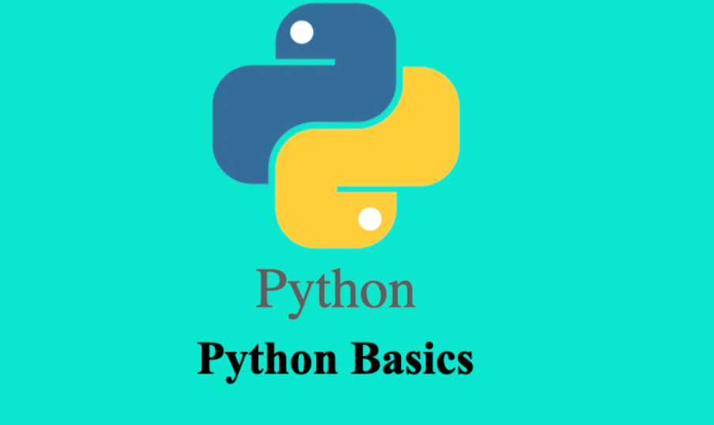

# Python_basics

## *Discription* : 
This is a simple project that implements different functions in Python.
This project was conducted as an exercise during a learnership hosted by [Girlcode](https://github.com/GirlCodeZA)

It was built using **PYTHON**.
## Tools used : *Visual Studio Code*

### How to Install this Project
 For now to have the project on your personal computer all you have to do is copy and clone it to your machine.

### How to Use The Project
1. Open the project on a code editor (VS CODE PREFERD)
2. Right click *index.py*
3. Then choose run python code on terminal
4. From here you can see the results on your console and it's simple like that.

### Contributions
Contributions are welcome. To contribute you can open a new issue or do a pull request.

### Author : **[Nonny Mahao](https://github.com/Nonny-Mahao)** 

### Licence
This project is [MIT](https://www.google.com) licensed.